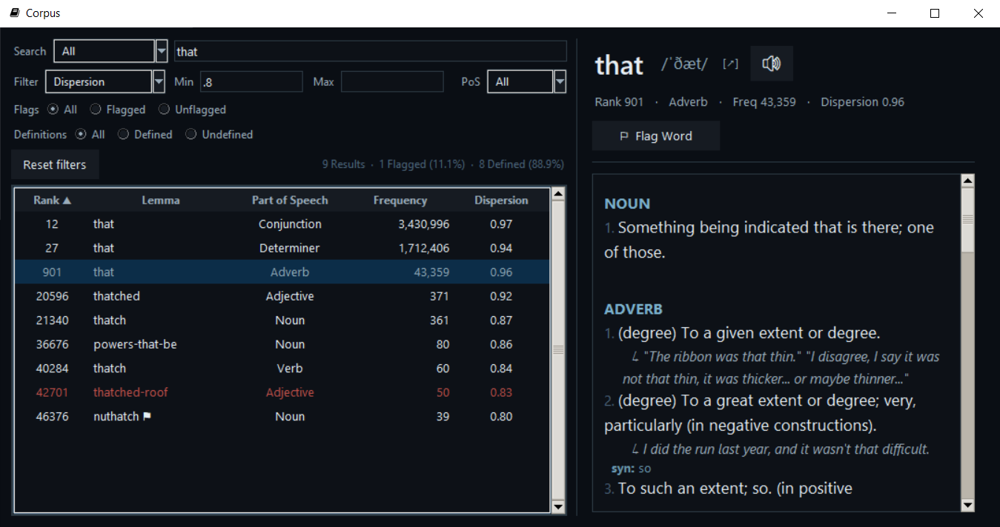

# Corpus app

English language database and dictionary.
Dataset is from https://www.wordfrequency.info/
Dictionary is from https://dictionaryapi.dev/

corpus/\
├── READ ME.txt\
├── Run.bat	# Run this to start\
├── corpus.py\
├── corpus_screenshot.png\
├── data/\
│   ├── dictionary.db\
│   ├── flagged_ranks.txt\
│   ├── not_found.txt\
│   └── words_list.txt\
├── icon.ico\
└── lib/

